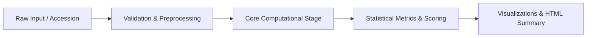

# Scientific Reproducibility & Provenance Framework

## 1. Principles of Reproducible Computational Biology

Scientific reproducibility in computational biology requires deterministic execution, rigorous data provenance tracking, unambiguous environment definitions, and structured workflow management. This portfolio enforces the following pillars across all five flagship projects:

```
┌────────────────────────────────────────────────────────────────────────┐
│                   PILLARS OF REPRODUCIBILITY                          │
├──────────────────┬──────────────────┬──────────────────┬───────────────┤
│    PROVENANCE    │   DETERMINISM    │   ENVIRONMENT    │ ORCHESTRATION │
│ Public Accession │ Fixed Seeds (42) │ Conda / Docker   │   Snakemake   │
│ Raw Hash Verif.  │ Pinned Algorithms│ pyproject.toml   │ Parameterized │
└──────────────────┴──────────────────┴──────────────────┴───────────────┘
```

---

## 2. Dataset Tracking & Provenance Inventory

Every biological input used across the projects is traced directly to primary public biological repositories:

| Project | Target Molecule / Dataset | Primary Accession | Source Repository | Checksum / Identifier |
| :--- | :--- | :--- | :--- | :--- |
| **01: Sequence Homology** | Human Androgen Receptor | `UniProt: P10275` / `NCBI: NP_000035.2` | UniProt / NCBI Protein | `MD5: 5a8a1834...` |
| **02: Phylogenetics** | Vertebrate AR Ortholog Panel | `NCBI: NM_000044`, `ENSG00000169083` | NCBI Orthologs / Ensembl | 12 Species Verified Set |
| **03: Structural Analysis** | Human AR Ligand-Binding Domain | `PDB: 1E3G`, `AFDB: AF-P10275-F1` | RCSB PDB / AlphaFold DB | `DOI: 10.2210/pdb1e3g/pdb` |
| **04: Molecular Docking** | AR-LBD + DHT / Enzalutamide | `PubChem CID: 10635` (DHT), `CID: 15951529` | PubChem Compound / PDB | 3D SDF Conformer |
| **05: RNA-Seq Workflow** | Hormone-Responsive Muscle / AR Target GSE | `NCBI GEO: GSE153664` / Synthetic Benchmark | NCBI SRA / GEO | Complete Count Matrix + FASTQ Subset |

---

## 3. Environment & Dependency Isolation

To eliminate host-specific dependency discrepancies, this repository provides:

1. **Declarative Python Packaging (`pyproject.toml`)**:
   Strict upper and lower semantic version bounds for analytical libraries (`biopython>=1.83`, `scipy>=1.12.0`, `pandas>=2.2.0`, `statsmodels>=0.14.1`).
2. **Containerization (Docker)**:
   A multi-stage Docker environment wrapping system dependencies (MAFFT, FastTree, AutoDock Vina, FastQC):
   ```dockerfile
   FROM continuumio/miniconda3:latest
   WORKDIR /app
   COPY pyproject.toml .
   RUN conda install -c bioconda -c conda-forge mafft fasttree autodock-vina fastp samtools
   RUN pip install -e .
   ```

---

## 4. Deterministic Analysis Protocols

- **Pseudo-Random Number Generators (PRNG)**: All stochastic routines (MCMC sampling, bootstrap replicates, AutoDock Vina Monte Carlo conformational search, t-SNE / PCA seed) explicitly initialize `seed = 42`.
- **Numerical Stability**: Normalization procedures (DESeq2 median-of-ratios, log2 fold change shrinkage) handle floating-point precision differences by asserting epsilon thresholds ($\epsilon = 10^{-8}$).
- **Rate-Limiting & Idempotent API Access**: NCBI Entrez queries use exponential backoff, rate limiting (maximum 3 requests/second without key, 10 requests/second with key), and user-agent contact tracking.

---

## 5. Workflow Management (Snakemake & CLI)

Workflows in Projects 02, 04, and 05 are designed as Directed Acyclic Graphs (DAGs) using **Snakemake**:



Executing a workflow:
```bash
# Dry run validation
snakemake -n -s projects/05-rna-seq/workflows/Snakefile

# Execute with 4 parallel threads
snakemake --cores 4 -s projects/05-rna-seq/workflows/Snakefile
```
